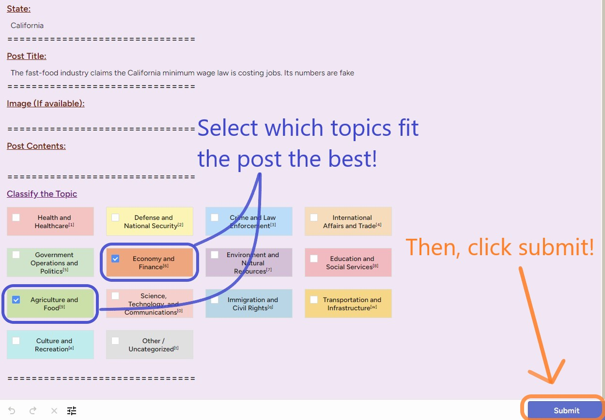

  
# Getting Started with Policy Area Labeling

Welcome to the **Political Compass Categorization Team**! This guide will walk you through the initial steps required to start labeling Reddit posts and comments using Label Studio. Follow the instructions below to begin your labeling tasks seamlessly.

---

# Getting Started

To help you navigate the labeling process efficiently, please follow these initial steps illustrated below:

## 1. Access Label Studio

- Launch your preferred web browser.  

- Navigate to [http://34.23.190.214:8080/](http://34.23.190.214:8080/).

---

## 2. Register an Account:  

- On the Label Studio homepage, click on the **"Sign Up"** or **"Register"** button.
- Fill in your email address and create a password. **Note:** Validation of the email is not required; it is solely used for your login credentials.


---

## 3. Enter the Project


```{r echo=FALSE, out.width='80%', results='asis', fig.align='center', fig.pos='H'}

```  

- After signing in, locate the **"Main Project"** button on your dashboard.
- Click the **"Main Project"** button to enter the project workspace.  


---

## 4. Begin Labeling


```{r echo=FALSE, out.width='80%', results='asis', fig.align='center', fig.pos='H'}

```  

- Within the project workspace, locate the blue **"Label All Tasks"** button.
- Click the **"Label All Tasks"** button to begin labeling.  


---

## 5. Label Policy Areas

```{r echo=FALSE, out.width='80%', results='asis', fig.align='center', fig.pos='H'}

```  

- **Review Content:** Carefully read the **Title**, **Image**, and **Contents** (if available) of each post or comment.  

- **Select a Policy Area:** Click on the policy areas that best fits the content. **You may choose multiple policy areas**.  

- **Submit:** After selecting the policy area, click **"Submit"** to move to the next task. 


---

## 6. Skip Tasks


```{r echo=FALSE, out.width='80%', results='asis', fig.align='center', fig.pos='H'}

```   


- If a task is too challenging, time-consuming, or does not clearly fit into any policy area, you can **Skip** it.  

- Click the **"Skip"** button to move to the next task without assigning a label.  


---

# Additional Tips for Getting Started

- **Familiarize Yourself:** Before diving into labeling, take some time to review the **Policy Area Reference Guide** to understand each category thoroughly.
- **Practice Labeling:** Start with a few practice tasks to get comfortable with the labeling interface and process.
- **Maintain Focus:** If you've been labeling too long or are getting frustrated, close out the labeling and come back later!
- **Seek Assistance:** If you encounter any issues or have questions, reach out.

---

# Contact and Support

If you encounter any issues, have questions, or need further clarification, please reach out to the project team:

- **Support:** Daniel Forcade  

  **Email:** dforcade@gatech.edu  
  
  **Github:** https://github.com/rundowntown  
  
  