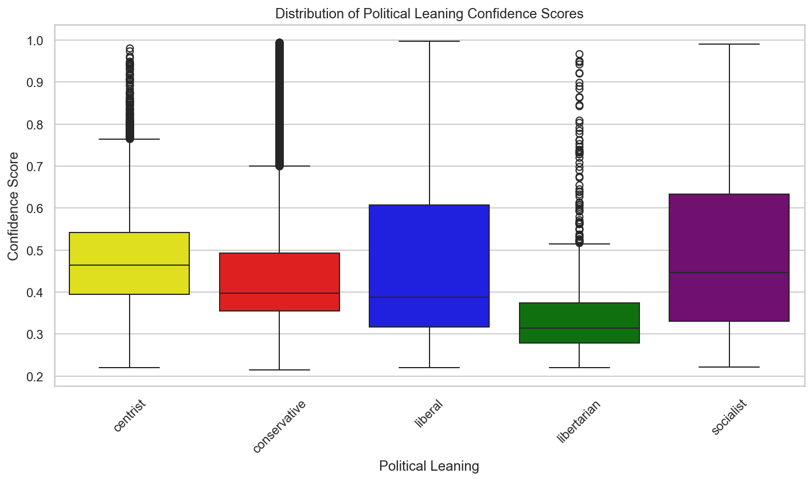

```{r setup, include=FALSE}
knitr::opts_chunk$set(echo = TRUE)
library(gridExtra)
library(png)
library(grid)
```


# Introduction
    
This report presents a comprehensive analysis of Vermont-specific Reddit comments. The objective is to extract meaningful insights related to emotions, sentiments, political biases, and topic distributions within the Vermont Reddit community. The analysis leverages transformer-based natural language processing (NLP) models, topic modeling techniques, and various data analysis methodologies to uncover patterns and associations within the dataset.


# What Was Performed
    
I conducted an in-depth analysis of Vermont-specific Reddit comments to extract meaningful insights related to emotions, sentiments, political biases, and topic distributions. The analysis comprised the following key steps.

---
    
## 1. Data Collection & Preparation
    
- **Data Source:** Imported `reddit_comments.csv` with parsed datetime to capture the temporal aspect of comments.
- **Filtering:** Isolated comments pertaining to Vermont by filtering the `state` column.
- **Text Cleaning:** Performed minimal text preprocessing by removing URLs, @mentions, and hashtags using regular expressions to ensure data quality.
- **Quality Assurance:** Eliminated empty entries to maintain the integrity of the dataset.
- **Indexing:** Set the `created_utc` timestamp as the DataFrame index to facilitate time series analysis.

---  

## 2. Natural Language Processing (NLP) Model Initialization
    
Utilized several transformer-based models to analyze the comments. Below is a detailed overview of each model, including their architectures, methodologies, and roles within the analysis:
    
### **1. Emotion Classification**
    
- **Model:** `j-hartmann/emotion-english-distilroberta-base`
- **Architecture:** 
  - **Type:** Transformer-based neural network.
  - **Specifics:** This model is a distilled version of RoBERTa (`distilroberta`), which is itself a robustly optimized BERT pretraining approach.
  - **Parameters:** Distillation reduces the model size and inference time while retaining much of the original model's performance.
- **Methodology:** 
  - **Training:** Fine-tuned on emotion-labeled datasets to classify text into various emotional categories.
  - **Functionality:** Processes input text by converting it into embeddings through multiple transformer layers, capturing contextual nuances before classifying the emotion.
- **Purpose:** Identified emotions expressed in each comment by analyzing the textual content, enabling the classification of sentiments such as joy, anger, sadness, etc.
    
### **2. Sentiment Analysis**
    
- **Model:** `finiteautomata/bertweet-base-sentiment-analysis`
- **Architecture:** 
  - **Type:** Transformer-based neural network, specifically a BERTweet model.
  - **Specifics:** BERTweet is a RoBERTa-based model trained on large-scale English Twitter data, optimized for social media text.
- **Methodology:** 
  - **Training:** Fine-tuned on sentiment-labeled datasets derived from social media to assess sentiment intensity.
  - **Functionality:** Utilizes token embeddings and transformer layers to understand the sentiment conveyed in the text, categorizing it as Negative, Neutral, or Positive.
- **Purpose:** Assessed sentiment intensity of comments, enabling the categorization of sentiments to gauge community mood and attitudes.
    
### **3. Political Bias Detection**
    
- **Model:** `cardiffnlp/twitter-roberta-base-sentiment-latest`
- **Architecture:** 
  - **Type:** Transformer-based neural network, specifically a RoBERTa model.
  - **Specifics:** Trained on Twitter data, optimized for sentiment and bias detection in social media contexts.
- **Methodology:** 
  - **Training:** Fine-tuned on datasets annotated for political bias and sentiment, allowing it to discern nuanced biases in text.
  - **Functionality:** Processes text through transformer layers to capture contextual biases, classifying them as Negative, Neutral, or Positive.
- **Purpose:** Determined the political bias of each comment, aiding in understanding the political landscape and leanings within the Vermont Reddit community.
    
### **4. Political Leaning Classification**
    
- **Model:** `facebook/bart-large-mnli` (Zero-Shot Classification)
- **Architecture:** 
  - **Type:** Transformer-based neural network, specifically the BART architecture.
  - **Specifics:** BART is a sequence-to-sequence model that combines bidirectional and autoregressive transformers, optimized for various NLP tasks.
- **Methodology:** 
  - **Zero-Shot Classification:** Utilizes the model's understanding of language to classify text into predefined categories without explicit training on those categories.
  - **Functionality:** Generates embeddings for input text and evaluates the compatibility of these embeddings with candidate labels (e.g., Centrist, Conservative).
- **Purpose:** Classified political leanings of comments into categories such as Centrist, Conservative, Liberal, Libertarian, and Socialist, enabling a nuanced understanding of political orientations within the dataset.
    
### **5. Named Entity Recognition (NER)**
    
- **Model:** `dslim/bert-base-NER`
- **Architecture:** 
  - **Type:** Transformer-based neural network, specifically a BERT model.
  - **Specifics:** BERT (Bidirectional Encoder Representations from Transformers) is a bidirectional transformer model trained on a large corpus to understand context in text.
- **Methodology:** 
  - **Training:** Fine-tuned on NER datasets to identify and classify entities within text into categories such as Persons, Locations, and Organizations.
  - **Functionality:** Processes input text to recognize entity boundaries and assign appropriate labels using token embeddings and transformer layers.
- **Purpose:** Extracted entities like Persons, Locations, and Organizations from comments, facilitating structured information extraction and enhancing topic and sentiment analyses.
    
### **6. Embedding Extraction**
    
- **Model:** `sentence-transformers/all-MiniLM-L6-v2`
- **Architecture:** 
  - **Type:** Transformer-based neural network, specifically a Sentence-BERT (SBERT) model.
  - **Specifics:** MiniLM is a compact, efficient transformer model optimized for generating high-quality sentence embeddings.
- **Methodology:** 
  - **Training:** Trained on a variety of sentence-pair tasks to produce semantically meaningful embeddings that capture the essence of sentences.
  - **Functionality:** Converts input text into fixed-size numerical vectors (embeddings) that encapsulate semantic information, enabling similarity comparisons and clustering.
- **Purpose:** Generated numerical representations of comments for subsequent topic modeling, allowing for effective clustering and semantic analysis of the dataset.


---  


## 3. Topic Modeling
    
Implemented two approaches to identify prevalent topics within the comments:
    
- **KMeans Clustering:** 
  - **Clusters Identified:** 10 distinct topics based on comment embeddings.
  - **Analysis:** Utilized TF-IDF to extract and interpret top terms per cluster.
      
- **BERTopic:** 
  - **Purpose:** Applied for more nuanced and probabilistic topic discovery, allowing for overlapping and hierarchical topics.


--- 


## 4. Data Analysis Techniques
    
- **Statistical Testing:** Conducted Chi-Squared tests to explore associations between political leanings and both sentiment intensity and emotions.
- **Correlation Analysis:** Evaluated relationships between various confidence scores (emotion, bias, sentiment, political leaning).
- **Filtering & Weighted Analysis:** Focused on comments with high sentiment confidence scores ($\geq$ 0.7) and calculated weighted emotion scores per political leaning.
- **Visualization:** Generated t-SNE plots to visualize high-dimensional embeddings and created various plots to illustrate findings, including distribution plots, heatmaps, and scatter plots.
  
  
---  


# Results
    
## 1. Emotional Insights  

{width=50%}
{width=50%}
    
## 2. Sentiment Analysis
    
{width=50%}
{width=50%}

- **Emotion Counts:** Neutral emotions dominate, followed by Disgust and Surprise.
- **Sentiment Counts:** Negative and Neutral sentiments are prevalent, with fewer Positive sentiments.
- **Boxplots:** Show variability in confidence scores across different emotions and sentiments, indicating varying levels of classification certainty.


## 3. Political Leaning
    
{width=45%}
{width=45%}

- **Centrist Dominance:** A large proportion of comments are from centrists, with conservatives being the next largest group.
- **Heatmaps and Crosstabs:** Demonstrate the association between political leaning and both sentiment intensity and emotions, reinforcing the significant Chi-squared test results.
- **Boxplots:** Reveal differences in confidence scores across political leanings, indicating varying levels of certainty in classifications based on political orientation.

## 4. Named Entity Recognition (NER)
    
- **Outcome:** 
  - No entities detected for Persons, Locations, or Organizations.
  - **Note:** Word clouds were not generated due to lack of detected entities.
    
## 5. Topic Modeling
    
### KMeans Clustering
    
- **Top Terms per Cluster:**
  - **Cluster 0:** like, just, gif, giphy, don, lol, time, ve, people, know
  - **Cluster 1:** people, just, car, road, don, like, driving, drive, going, time
  - **Cluster 2:** thank, thanks, love, beautiful, good, great, nice, awesome, happy, reddiquette
  - **Cluster 3:** vermont, vt, state, vermonters, people, like, new, just, nh, vermonter
  - **Cluster 4:** people, tax, state, just, money, housing, taxes, like, don, pay
  - **Cluster 5:** like, just, town, snow, burlington, live, place, time, season, stowe
  - **Cluster 6:** fact, best, exactly, ok, friend, friendly, going, goes, god, glad
  - **Cluster 7:** lol, like, good, yes, fuck, oh, just, did, ok, looks
  - **Cluster 8:** people, don, just, like, trump, think, right, vote, biden, know
  - **Cluster 9:** deleted, removed, reddit, zero, follow, giving, given, giphy, gif, getting
  
{width=50%}
{width=50%}
    

    
### BERTopic
    
- **Topic Counts:**
  
  | BERTopic Topic | Count |
  |----------------|-------|
  | -1             | 23,822|
  | 0              | 1,080 |
  | 1              | 882   |
  | 2              | 609   |
  | 3              | 511   |
  | 620            | 10    |
  | 621            | 10    |
  | 622            | 10    |
  | 623            | 10    |
  | 624            | 10    |
  | **Total:**     | 626   |
    
- **Observation:** BERTopic generated an excessive number of topics, with the majority of comments falling into the outlier category (`-1`). This suggests potential over-segmentation and the need for parameter tuning.  However, filtering outliers out shows BERT Topic modeling is promsing for this data, as will be seen in the Bert tSNE plot below.

```{r bertTopic, fig.align='center', out.width='50%', echo=FALSE}

```  


    
## 6. Statistical Associations
    
### Political Leaning vs. Sentiment Intensity

```{r politicalLeaningSentimentCoor, fig.align='center', out.width='50%', echo=FALSE}

``` 


- **Chi-Squared Test:** 
  - **Chi² Statistic:** 2765.90
  - **p-value:** p < 0.00005
  - **Interpretation:** Significant association between political leaning and sentiment intensity.

### Political Leaning vs. Emotion

```{r politicalLeaningEmotionCoor, fig.align='center', out.width='50%', echo=FALSE}

```  


- **Chi-Squared Test:** 
  - **Chi² Statistic:** 1893.01
  - **p-value:** p < 0.00005
  - **Interpretation:** Significant association between political leaning and emotions expressed.
    
### Correlation Matrix for Confidence Scores  

```{r corrConf, fig.align='center', out.width='50%', echo=FALSE}

```  


    
- **Interpretation:** Weak correlations among emotion, bias, sentiment, and political leaning scores, indicating that the classifiers operate independently.
    
### Filtered Analysis
    
- **Comments Filtered:** 40,862 comments with Sentiment Score $\geq$ 0.7
- **Weighted Average Emotion Scores per Political Leaning:**
  
  | Political Leaning | Weighted Emotion Score |
  |-------------------|------------------------|
  | Centrist          | 0.705                  |
  | Conservative      | 0.677                  |
  | Liberal           | 0.694                  |
  | Libertarian       | 0.674                  |
  | Socialist         | 0.681                  |
    

    
    
### Topic Modeling Analysis w t-SNE  


- **t-SNE Plot Overview:** Show clear differentiation among KMeans clusters and promising differentiation based on political leaning, indicating that embeddings capture meaningful semantic distinctions.
  
- **KMeans Clustering:** Identified distinct clusters with coherent top terms, useful for understanding prevalent discussion themes with more refinement.    

- **KMeans Clustering Political Leanings:** Clusters show interesting leanings, with clear conservative concentration in **cluster 8**.  


{width=50%}
{width=50%}

-- **KMeans Clustering Emotion:** There are differences in emotion on the topics identified so far, but we'll have to go deeper into statistical testing or perhaps 3-D visualization to more clearly represent and explore.  

-- **BERTopic Modeling:** When filtering out outliers and 'others', we start to get some clear clusters developing.  This is prime for exploration and identification of political groups/interests, especially when combined with the `policy text` subjects from the `bill_info` for the next phase.  


{width=50%}
{width=50%}


### Time-Series Trends  

I'm tracking many of these metrics through time series as well for event detection and reaction, and I'll expand this analytical section at a later date when the models are more refined and tuned.

```{r kMeans, fig.align='center', out.width='66%', echo=FALSE}

```


{width=50%}
{width=50%}


### Wordclouds  

**Steven loves wordclouds**  

These wordclouds are right now showing the differences in the Political Leaning Transformer-based neural network One-Shot that is using my political buckets.  Some promising results here, but obviously more NLP preprocessing is needed.  **Note**: The political leaning is a placeholder for **Policy Topics** from the bill data.  Ideally, we'll see how people are feeling about those subjects in the states compared with their politians actions.

```{r code, echo = FALSE}

# Load images
centrist <- rasterGrob(readPNG("wordcloudCentrist.png"), interpolate = TRUE)
conservative <- rasterGrob(readPNG("wordcloudConservative.png"), interpolate = TRUE)
liberal <- rasterGrob(readPNG("wordCloudLiberal.png"), interpolate = TRUE)
socialist <- rasterGrob(readPNG("wordcloudSocialist.png"), interpolate = TRUE)

# Arrange images with labels
grid.arrange(
  arrangeGrob(centrist, top = textGrob("Centrist", gp = gpar(fontsize = 14, fontface = "bold"))),
  arrangeGrob(conservative, top = textGrob("Conservative", gp = gpar(fontsize = 14, fontface = "bold"))),
  arrangeGrob(liberal, top = textGrob("Liberal", gp = gpar(fontsize = 14, fontface = "bold"))),
  arrangeGrob(socialist, top = textGrob("Socialist", gp = gpar(fontsize = 14, fontface = "bold"))),
  ncol = 2
)
```


---  


# Next Steps

    
## 1. Enhancing Named Entity Recognition (NER)
    
- **Advanced Preprocessing:** Implement more sophisticated text normalization techniques to handle informal language, slang, abbreviations, and misspellings commonly found in Reddit comments.
- **Alternative NER Models:** Experiment with different NER models trained on social media data, such as `xlm-roberta-base` or models fine-tuned specifically for Reddit or Twitter data.
- **Custom NER Training:** Consider fine-tuning an NER model on a labeled dataset similar to your Reddit comments to improve entity extraction performance.
    
## 2. Refining Topic Modeling
    
- **Parameter Tuning for BERTopic:** Adjust BERTopic parameters (e.g., `nr_topics`) to reduce the number of topics and improve coherence. Explore hierarchical topic modeling to capture broader and more specific themes.
- **Alternative Topic Modeling Techniques:** Explore other topic modeling methods like Latent Dirichlet Allocation (LDA) or Non-Negative Matrix Factorization (NMF) for comparison and validation.
- **Topic Filtering:** Aggregate similar topics and filter out infrequent ones to enhance interpretability.
- **Bert Features Extractions**: Start extraction from refined topics 
    
## 3. Integrating Policy Classifiers from Congress.gov Data
    
- **Policy Classifier Integration:**
  - **Data Source:** Utilize policy data from congress.gov to obtain classifications of bills sponsored by Vermont representatives.
  - **Zero-Shot Classification:** Use these policy categories as labels in a Zero-Shot Classification framework to classify Reddit comments based on the policies their representatives are sponsoring.
  - **Objective:** Determine if and how discussions within Reddit comments align with the legislative activities and policy focuses of their elected officials.
      
- **Implementation Steps:**
  - **Data Collection:** Gather policy categories and corresponding keywords from congress.gov.
  - **Model Adjustment:** Update the Zero-Shot Classification pipeline to include these policy categories as candidate labels.
  - **Analysis:** Assess the prevalence and sentiment of discussions related to specific policies, correlating them with the activities of Vermont's representatives.
    

## 4. Advanced Statistical and Machine Learning Techniques
    
- **Regression Models:** Implement regression analyses to predict sentiments or emotions based on political leanings, topics, and other features.
- **Clustering Validation:** Assess the quality of clusters using metrics like silhouette score or Davies-Bouldin index to ensure meaningful segmentation.
- **Causal Inference:** Explore potential causal relationships between political leanings and expressed sentiments/emotions to understand underlying drivers.
    
    
# Conclusion
    
The analysis of Vermont Reddit comments reveals a predominantly neutral and negative sentiment landscape, heavily influenced by the political leanings of the commenters.  Models are working and there are positive signs for actionable results, but more work is needed. KMeans clustering effectively identified distinct topics based on comment content, while BERTopic's over-segmentation suggests a need for further model tuning. The clear differentiation in embedding visualizations underscores the richness of the semantic information captured. Addressing the limitations in Named Entity Recognition and refining topic modeling approaches will further enhance the depth and accuracy of future analyses.  More NLP preprocessing, model refinement and adjustment, and bucketing techniques should result in improved differentiation for statistical inference.
    
By integrating policy classifiers from congress.gov data, future analyses can link online discourse with legislative activities, providing insights into how policy discussions influence or reflect community sentiments and emotions.
    
---
    
# References
    
- Transformers Libraries: https://huggingface.co/transformers/
- BERTopic Documentation: https://maartengr.github.io/BERTopic/
- t-SNE Overview: https://lvdmaaten.github.io/tsne/
- Chi-Squared Test Explanation: https://en.wikipedia.org/wiki/Chi-squared_test
- Latent Dirichlet Allocation (LDA): https://en.wikipedia.org/wiki/Latent_Dirichlet_allocation
- Non-Negative Matrix Factorization (NMF): https://en.wikipedia.org/wiki/Non-negative_matrix_factorization
- UMAP: https://umap-learn.readthedocs.io/en/latest/
